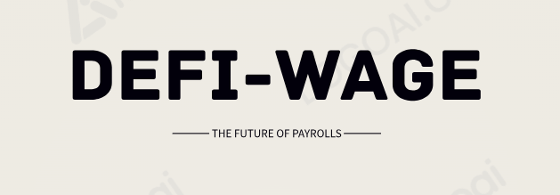

## DeFi-Wage


DeFi-Wage is a decentralized payroll system that runs on ZK Scroll Sepolia, a Layer 2 solution for Ethereum, offering an innovative solution to streamline salary management for businesses and organisations. It is designed to be more efficient, secure, and cost-effective than traditional payroll systems. Using the power of Ethereum and ZK Rollups, DeFi-Wage is designed to enhance throughput, reduce costs, and provide a faster and more secure way to manage employee salaries.

### Live Demo
https://defi-wage.vercel.app/

## How it works

DeFi-Wage uses a smart contract to manage the payroll process. The smart contract is responsible for calculating salaries, distributing wages, and processing loans.

To get started with DefiWage, you will need to create a company account or get added by your Employer. Once you have created an account, you can add employees and set their salaries. You can also deposit funds into the contract to cover payroll expenses.

At the end of each month, the smart contract will automatically calculate salaries and distribute wages to employees. Employees can then withdraw their wages from the contract to their own wallets.

## Did you know ?

DeFi-Wage is so good, it's worth stealing for! (Just kidding, please don't steal it :)

## Why use DeFi-Wage?
* Cost: Scroll transactions are significantly cheaper than Ethereum transactions, so you can save money on gas fees.
* Throughput: Scroll can handle more transactions per second than Ethereum, which means that your payroll will always be processed on time.
* Speed: Scroll transactions are processed much faster than Ethereum transactions, so you can get your paycheck faster.

## Technology Stacks
* Zk Scroll Sepolia
* NextJS
* Tailwind Css
* Wagmi & Rainbowkit
* Solidity & Hardhat
* IPFS & Web3 storage


## Features
* Create Company / Organisation Workspace.
* Add Emmployees and Set their wages.
* Make Monthly Payments to employees platform wallets.
* Employees can withdraw their Wages from the platform wallets.


## Deployed contract addresses on the zK Scroll rollup

```bash


DeFi Wage Manager Contract: 0x9012537AB7E6Fc7f3e5CB37E5c98ad0150823318
''

```

## Conclusion

DeFi-Wage is the future of payroll. It is more efficient, secure, and cost-effective than traditional payroll systems. If you are looking for a better way to manage your payroll, then DefiWage is the solution for you.